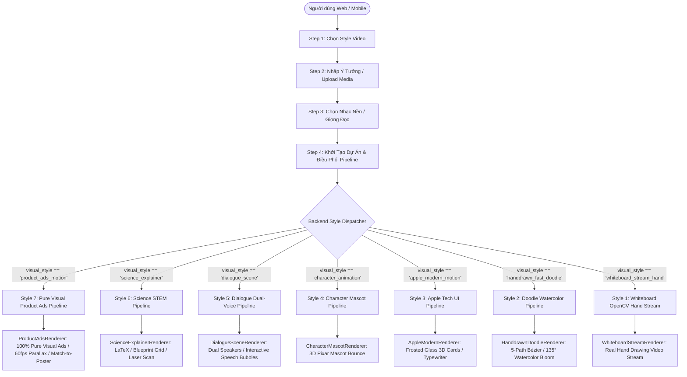
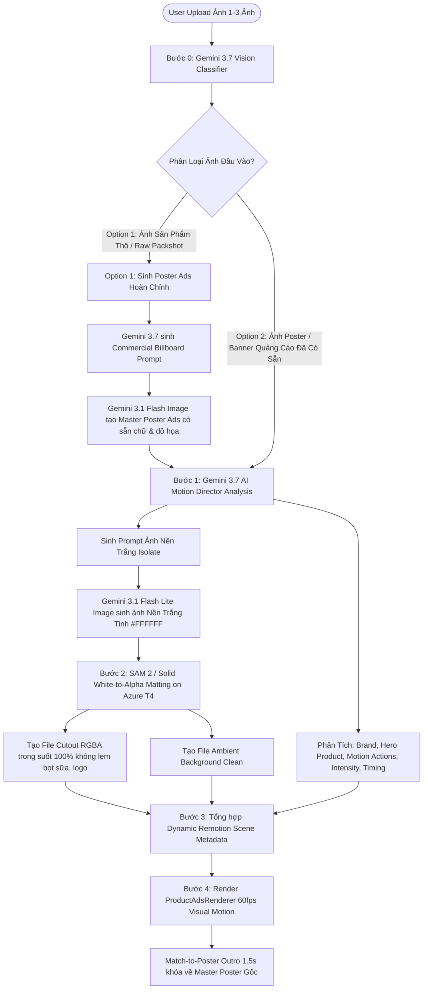

# 🎬 WYNMOTION AI — MASTER PIPELINE & ARCHITECTURE SPECIFICATION
**Tài liệu Quy chuẩn Kiến trúc Hệ thống & Điều phối Agent Gemini 3.7 Toàn diện**
*Phiên bản: 3.2 — Áp dụng đồng bộ trên Web (`wordai`), Mobile App iOS (`WynMotion-AI`), Backend (`wordai-aiservice`) và Remotion Engine*

---

## 📑 MỤC LỤC
1. [Tổng Quan Kiến Trúc & Triết Lý Thiết Kế](#1-tổng-quan-kiến-trúc--triết-lý-thiết-kế)
2. [Quy Chuẩn Cốt Lõi Style 7: 100% Thuần Visual Motion Ads (Không Text Phụ Đề/Script)](#2-quy-chuẩn-cốt-lõi-style-7)
3. [Flow Style 7: 2 Tùy Chọn Ảnh Đầu Vào (Raw Product vs Ready Poster)](#3-flow-style-7-2-tùy-chọn-ảnh-đầu-vào)
4. [Quy Chuẩn Kịch Bản Theo Số Lượng Ảnh (1, 2 và 3 Ảnh)](#4-quy-chuẩn-kịch-bản-theo-số-lượng-ảnh)
5. [Hệ Thống Phân Cấp Chuyển Động (Motion Hierarchy) & Cường Độ (Motion Intensity)](#5-hệ-thống-phân-cấp-chuyển-động--cường-độ)
6. [Signature WynMotion: Match-to-Poster (Tái Hợp Vật Thể Vào Poster Gốc)](#6-signature-wynmotion-match-to-poster)
7. [Thư Viện Hành Động Chuyển Động (Motion Action Library) & Chuỗi Hành Động](#7-thư-viện-hành-động-chuyển-động--chuỗi-hành-động)
8. [Gemini 3.7 — Đạo Diễn Chuyển Động Độc Lập (AI Motion Director Agent)](#8-gemini-37--đạo-diễn-chuyển-động-độc-lập)
9. [Bảng Quy Chuẩn Pipeline & Render Riêng Biệt Cho 7 Styles](#9-bảng-quy-chuẩn-pipeline--render-riêng-biệt-cho-7-styles)
10. [Quy Chuẩn Bố Cục UI Renderer Tại Trang Result (Pure Visual Ads Standard)](#10-quy-chuẩn-bố-cục-ui-renderer-tại-trang-result)

---

## 1. TỔNG QUAN KIẾN TRÚC & TRIẾT LÝ THIẾT Kế



---

## 2. QUY CHUẨN CỐT LÕI STYLE 7: 100% THUẦN VISUAL MOTION ADS
*(Pure Visual Commercial Ads — Zero Synthetic Text Overlays)*

### ⚠️ NGUYÊN TẮC BẤT BIẾN CỦA STYLE 7:
1. **KHÔNG CÓ BẤT KỲ TEXT GIỌNG ĐỌC, SCRIPT HAY PHỤ ĐỀ NÀO RENDER ĐÈ LÊN MÀN HÌNH:**
   - Tuyệt đối không sinh thêm các khối HTML/React Text nhân tạo (không có Subtitle Bar, không có Note Card, không có Typography đè).
   - **Poster gốc của thương hiệu đã có sẵn Typography nghệ thuật, Logo, Giá và Tagline thiết kế chuẩn.** Video phải tôn vinh trọn vẹn tác phẩm poster đó!
2. **TOÀN BỘ VIDEO CHỈ LÀ HÌNH ẢNH ADS THỰC TẾ + HIỆU ỨNG CHUYỂN ĐỘNG:**
   - **Layer Nền (Background):** Ảnh Poster gốc / Ambient Blur Background chuyển động Parallax 2.5D, zoom nhẹ và quét góc quay.
   - **Layer Vật Thể (Hero Product):** Ảnh vật thể PNG bóc tách trong suốt 100% chất lượng cao (SAM 2) bay lượn 3D, phóng to bật nảy (`zoom_pop`, `scale_pop`, `from_bottom`), lơ lửng điều hòa (`gentle_sine`), nghiêng góc 3D (`3d_tilt`).
   - **Layer Hiệu Ứng (Visual FX):** Tia sáng neon phát ra sau vật thể, hạt bụi sáng bokeh lấp lánh, hiệu ứng lóe sáng chuyển cảnh White Flash 0.3s.
   - **Layer Kết Thúc (Outro):** Tái hợp toàn bộ vật thể và chuyển động khóa khớp hoàn hảo 100% về bức ảnh **Master Poster Ads ban đầu** (Match-to-Poster).

---

## 3. FLOW STYLE 7: 2 TÙY CHỌN ẢNH ĐẦU VÀO



- **Option 1 (Ảnh sản phẩm thô):** Người dùng đưa ảnh chụp chai nước, ly trà sữa, đôi giày thô $\rightarrow$ Gemini 3.7 tạo prompt studio thương mại và sinh ra **Master Poster Ads hoàn chỉnh** (đã chứa sẵn text nghệ thuật, ánh sáng studio, bố cục poster). Sau đó chuyển sang Bước 1.
- **Option 2 (Ảnh Poster hoàn chỉnh có sẵn):** Đi thẳng vào Bước 1 phân tích chuyển động.

---

## 4. QUY CHUẨN KỊCH BẢN THEO SỐ LƯỢNG ẢNH (MARVEL / FAST ADS STANDARD)

### 🎬 Kịch Bản 1 Hình Ảnh (6.0s – 8.0s, Mặc định 7.0s): *The Hero Impact & Deal Buster*
```text
0s ──────── 0.5s ────── 1.4s ─────────────────── 5.8s ─────── 7.0s (End)
   ENTRANCE     BG REVEAL      ANAMORPHIC SHEEN         MATCH-TO-POSTER
      ↓             ↓                 ↓                        ↓
 Object Pop    Background      Specular Light Scan     Reassembly Lock
 (Spring Pop)  Bung Sáng       & Camera Ken Burns       to Master Poster
```
- **0.0s – 0.5s (NHỊP 1 - ENTRANCE):** Hero Cutout xuất hiện nhanh & dứt khoát tại trung tâm (Scale Spring Pop).
- **0.4s – 1.4s (NHỊP 2 - BG REVEAL):** Background ảnh gốc hiển thị dần (Smooth Reveal) đúng ngay tại vị trí của vật thể (hiệu ứng xuất hiện nhân vật/sản phẩm rồi bung sáng toàn cảnh).
- **1.4s – 5.8s (NHỊP 3 - SHEEN & FLOAT):** Vệt sáng phản quang Anamorphic Sheen quét qua bề mặt sản phẩm, camera lướt nhẹ chậm rãi (không rung lắc giật cục).
- **5.8s – 7.0s (NHỊP 4 - OUTRO):** Tái hợp khóa khớp 100% về Master Poster gốc (Match-to-Poster Outro 1.2s).

---

### 🎬 Kịch Bản 2 Hình Ảnh (Tổng 15.0s = 7.5s + 7.5s): *Dynamic Duo / Match & Combo*
```text
SCENE 1 (7.5s)       ──[Fast Flash / Whip]──>       SCENE 2 (7.5s)       ──>       OUTRO (1.2s)
──────────────                                      ──────────────                 ──────────────
Product A (Marvel Motion)                           Product B (Marvel Motion)      Master Poster
Background Reveal                                   Background Reveal              Match-to-Poster
```
- **Scene 1 (7.5s):** Product A xuất hiện $\rightarrow$ BG Reveal $\rightarrow$ Light Sheen $\rightarrow$ Chuyển cảnh Fast Flash / Whip siêu nhanh ở 0.5s cuối.
- **Scene 2 (7.5s):** Product B xuất hiện $\rightarrow$ BG Reveal $\rightarrow$ Light Sheen $\rightarrow$ Match-to-Poster Outro 1.2s.

---

### 🎬 Kịch Bản 3 Hình Ảnh (Tổng 15.0s = 5.0s + 5.0s + 5.0s): *The Full Trilogy & Mega Promotion*
```text
SCENE 1 (5.0s)  ──[Fast Flash]──>  SCENE 2 (5.0s)  ──[Fast Flash]──>  SCENE 3 (5.0s)  ──>  OUTRO (1.2s)
Hero Product 1                     Hero Product 2                     Hero Product 3       Match-to-Poster
```
- **Scene 1 (5.0s):** Nhịp 1 (Cutout Pop 0-0.5s) $\rightarrow$ Nhịp 2 (BG Reveal 0.4-1.4s) $\rightarrow$ Nhịp 3 (Sheen 1.4-4.5s) $\rightarrow$ Fast Flash 4.5-5.0s.
- **Scene 2 (5.0s):** Nhịp 1 (Cutout Pop 0-0.5s) $\rightarrow$ Nhịp 2 (BG Reveal 0.4-1.4s) $\rightarrow$ Nhịp 3 (Sheen 1.4-4.5s) $\rightarrow$ Fast Flash 4.5-5.0s.
- **Scene 3 (5.0s):** Nhịp 1 (Cutout Pop 0-0.5s) $\rightarrow$ Nhịp 2 (BG Reveal 0.4-1.4s) $\rightarrow$ Nhịp 3 (Sheen 1.4-3.8s) $\rightarrow$ Match-to-Poster Outro 3.8-5.0s.

---

## 5. HỆ THỐNG PHÂN CẤP CHUYỂN ĐỘNG & CƯỜNG ĐỘ

### 🎯 Phân Cấp Chuyển Động (Visual Motion Hierarchy)
```text
HERO       ██████████  (Vật thể chính: Chuyển động 3D Parallax, bay lượn, nghiêng góc)
AMBIENT    ██          (Phông nền: Zoom chậm 1.02 -> 1.08, trôi nhẹ, hạt sáng neon)
OUTRO      ██████████  (Tái hợp vật thể khóa khớp hoàn hảo vào Master Poster Artwork)
```

### 🎨 Cường Độ Chuyển Động (Motion Intensity)
- **CALM / LOW** (Luxury, Mỹ phẩm, Nước hoa): Dao động nhẹ nhàng, chậm rãi (Amplitude: 4-6px, Freq: 0.04).
- **SUBTLE** (Thời trang tối giản, Đồng hồ): Lơ lửng nhẹ nhàng (Amplitude: 6-8px, Freq: 0.05).
- **MODERATE** (Công nghệ, Thiết bị gia dụng): Dứt khoát, thanh lịch (Amplitude: 8-12px, Freq: 0.07).
- **ENERGETIC** (F&B, Trà Sữa, Thức ăn nhanh): Bật nảy vui tươi, lắc lư sảng khoái (Amplitude: 12-16px, Freq: 0.09).
- **HYPE / HIGH** (Gaming, Flash Sale, Giới trẻ): Dập nảy mạnh mẽ, rung giật nhịp bass, chớp sáng (Amplitude: 18-24px, Freq: 0.12).

---

## 6. SIGNATURE WYNMOTION: MATCH-TO-POSTER
**Tái hợp toàn bộ chuyển động về Poster Gốc (Object Reassembly Outro)**

```text
        HERO PRODUCT (Lơ lửng 3D)
                 ↓
        AMBIENT BACKGROUND (Parallax)
                 ↓
   ┌───────────────────────────┐
   │    MASTER POSTER GỐC      │
   │    (Reassembled Artwork)  │
   └───────────────────────────┘
```
Toàn bộ chuyển động trong 1.5s cuối nhẹ nhàng lướt và khóa khớp chính xác 100% vào vị trí ban đầu trên Poster gốc. Video kết thúc bằng tác phẩm nghệ thuật hoàn chỉnh của thương hiệu mà không có bất kỳ yếu tố thừa nào!

---

## 7. THƯ VIỆN HÀNH ĐỘNG CHUYỂN ĐỘNG & CHUỖI HÀNH ĐỘNG

| Danh Mục | Các Hành Động Được Hỗ Trợ |
| :--- | :--- |
| **Product Entrance** | `from_bottom`, `from_left`, `from_right`, `zoom_pop`, `drop_in`, `scale_pop`, `split_in`, `mask_reveal` |
| **Product Motion** | `gentle_sine`, `energetic_bounce`, `3d_tilt`, `micro_zoom`, `sway`, `orbit`, `float`, `pulse` |
| **Transitions** | `whip_pan`, `zoom`, `push`, `swipe`, `flash`, `object_wipe`, `match_cut`, `morph`, `camera_move` |
| **Outro Actions** | `match_to_poster`, `snap_to_poster`, `assemble_to_poster`, `camera_pullback`, `reverse_reveal` |

---

## 8. GEMINI 3.7 — ĐẠO DIỄN CHUYỂN ĐỘNG ĐỘC LẬP
**AI Motion Director Agent**

Gemini 3.7 phân tích và tạo metadata thuần túy cho visual motion:
```json
{
  "brand_name": "Phê La",
  "hero_product": "Ly Trà Ô Long Vani Sữa Phong Lan",
  "brand_colors": ["#E11D48", "#FBBF24", "#0F172A"],
  "motion_intensity": "ENERGETIC",
  "scenes": [
    {
      "scene_id": 1,
      "duration_sec": 7.5,
      "product_entrance": "from_bottom",
      "entrance_delay_sec": 0.0,
      "floating_style": "gentle_sine",
      "floating_amplitude": 14,
      "tilt_deg": 2.2,
      "white_bg_prompt": "Commercial packshot of iced Oolong Vanilla Milk Tea cup with milk foam and vanilla bean specks, centered, pure solid white background (#FFFFFF), studio softbox lighting, 8k, clean edges."
    },
    {
      "scene_id": 2,
      "duration_sec": 7.96,
      "product_entrance": "zoom_pop",
      "floating_style": "energetic_bounce",
      "outro_type": "match_to_poster",
      "outro_duration_sec": 1.5
    }
  ]
}
```

---

## 9. BẢNG QUY CHUẨN PIPELINE & RENDER RIÊNG BIỆT CHO 7 STYLES

| Style ID | Tên Phong Cách | Input Step 2 | Step 3 Giọng Đọc / Nhạc | Pipeline Backend Xử Lý | Renderer Component Tại Result |
| :--- | :--- | :--- | :--- | :--- | :--- |
| **Style 7** | `product_ads_motion` | **1–3 Ảnh Poster/Sản phẩm** | Nhạc nền BGM sôi động (Zero Text Overlay) | `ProductAdsPipeline`: Classifier $\rightarrow$ White BG $\rightarrow$ SAM 2 $\rightarrow$ Visual Remotion | `ProductAdsRenderer.tsx`: 100% Pure Visual Ads, Parallax, Match-to-Poster |
| **Style 6** | `science_explainer` | 5 Môn STEM (Toán, Lý, Hóa, Sinh, Tin) | Thuyết minh học thuật | `ScienceExplainerPipeline`: Công thức LaTeX, Lưới Blueprint, Laser Scan | `ScienceExplainerRenderer.tsx`: Lưới đồ thị, công thức toán học |
| **Style 5** | `dialogue_scene` | Ý tưởng hội thoại (3D Pixar / 2D Comic) | 2 Giọng AI Phân Vai (A & B đối đáp) | `DialogueScenePipeline`: Ghép nối âm thanh đối thoại & căn nhịp bóng thoại | `DialogueSceneRenderer.tsx`: 2 Nhân vật đàm thoại & bóng thoại |
| **Style 1** | `whiteboard_stream_hand` | Chủ đề thuyết trình vẽ tay | Explainer chuẩn nhịp | `WhiteboardStreamPipeline`: Vision Annotation $\rightarrow$ OpenCV Zhang-Suen stream clip | `WhiteboardStreamRenderer.tsx`: Bàn tay người thật vẽ mực từng nét |
| **Style 2** | `handdrawn_fast_doodle` | Ý tưởng kể chuyện sáng tạo | Storytelling truyền cảm | `HanddrawnDoodlePipeline`: 5 Họ Bézier $\rightarrow$ Loang màu nước 135° | `HanddrawnDoodleRenderer.tsx`: Nét vẽ chì + Màu nước loang |
| **Style 3** | `apple_modern_motion` | Ý tưởng công nghệ / SaaS UI | Tech / Professional | `AppleModernPipeline`: Thẻ kính mờ 3D Frosted Glass, Typewriter, Biểu đồ | `AppleModernRenderer.tsx`: Giao diện tối macOS, hiệu ứng gõ phím |
| **Style 4** | `character_animation` | Mascot Cáo 3D / Người Que | Kể chuyện hóm hỉnh | `CharacterMascotPipeline`: Nhân vật 3D nhún nhảy biểu cảm | `CharacterMascotRenderer.tsx`: Mascot Cáo 3D nhún nhảy |

---

## 10. QUY CHUẨN BỐ CỤC UI RENDERER TẠI TRANG RESULT (PURE VISUAL ADS STANDARD)

### ❌ CẤM TUYỆT ĐỐI trên Style 7 (Product Ads):
- **CẤM hiển thị bất kỳ text phụ đề (Subtitle), văn bản kịch bản (Script), thẻ ghi chú (Note Card), hay hộp thoại (Dialogue Capsule) nào trên video.**
- Toàn bộ không gian video dành trọn vẹn 100% cho hình ảnh poster nghệ thuật, vật thể sản phẩm 3D bóc tách và các hiệu ứng thị giác.

### ✅ Cấu trúc các tầng hiển thị chuẩn của `ProductAdsRenderer.tsx`:
```text
┌────────────────────────────────────────────────────────┐
│ [Layer 1: Ambient BG] 2.5D Parallax Background Zoom    │
│                                                        │
│ [Layer 2: Ambient Particles] Neon Glow Rays & Bokeh    │
│                                                        │
│ [Layer 3: Hero Product] 2.5D Parallax 3D Floating      │
│                         (Cutout PNG Solid Matting)     │
│                                                        │
│ [Layer 4: Flash] White Flash Transition (0.3s)         │
│                                                        │
│ [Layer 5: Outro 1.5s] Signature Match-to-Poster        │
│                       (Object Reassembly to Master)    │
└────────────────────────────────────────────────────────┘
```
